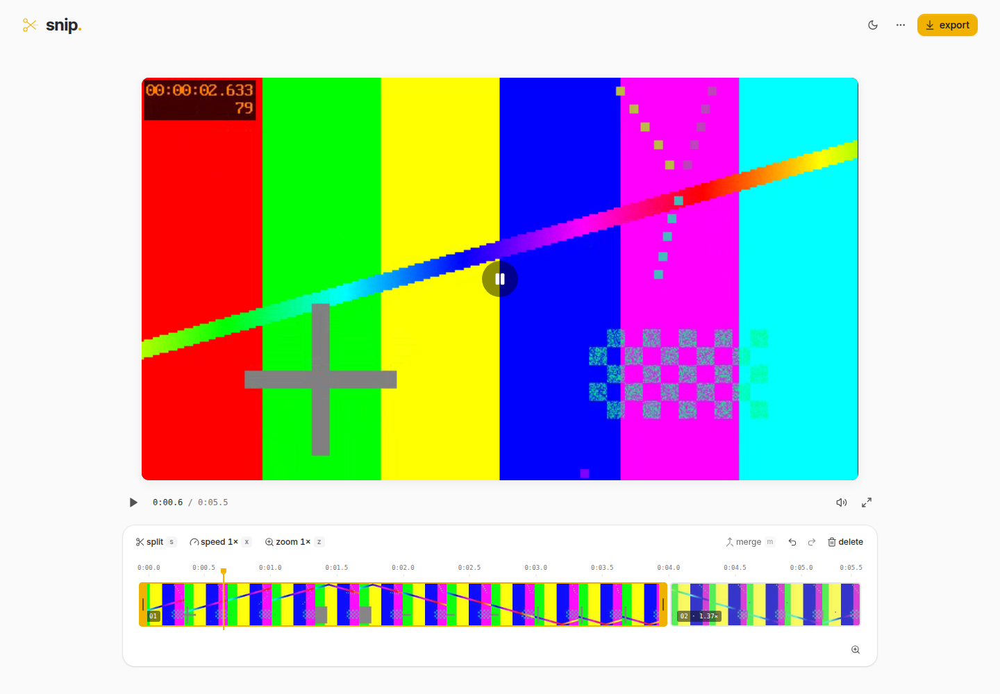

# snip.

a simple video editor for short demos, right in your browser.

- trim, split, merge, and reorder clips.
- adjust clip speed and zoom in on what matters.
- export mp4 or webm videos without a watermark.
- autosave your work and download projects to reopen later.
- keep videos on your device and edit offline after the first load.

please report failures by opening an issue. pull requests are welcome.

## JSON editing and agents

Choose **use snip with your agent** to inspect or copy a static setup prompt; neither action starts a connection. When hosted MCP is configured, give the prompt to your agent, open the one-time authorization link it returns, choose **Open Snip to connect**, and approve the matching request in Snip. The prompt directs the agent to use the browser connection first and to ask for confirmation before cloning the repository for local fallback. The editor and agent share a validated TypeScript editing core, with undo, revision checks, and retry protection. Browser exports use a fixed FFmpeg profile for repeatability.

The hosted relay uses MCP over HTTPS and a WebSocket to the approved tab. Video stays in the browser; requested frames can be shared with the agent and exports download locally. Set `VITE_SNIP_MCP_ORIGIN` in the website build to enable it. Run the relay with [Docker on a VM](docs/editing-engine.md#deploy-the-relay-with-docker-on-a-vm) or [Render](docs/editing-engine.md#deploy-the-https-endpoint-on-render). The original local/VM bridge remains the fallback when no hosted relay is configured.

## Edit with Jev

Use **switch to chat** at the right of the editor’s toolbar, type an edit, and press Enter. The prompt replaces the manual action buttons; the timeline stays visible and usable in both modes. **Switch to editor** brings the buttons back in the same row, and drafts survive switching. Try “trim the first 2 seconds”, “split at 4 seconds and make the second clip 2× faster”, or “zoom in a little”. Edits appear immediately and each request is one undo step. “Split 3 seconds after” splits three seconds after the playhead at the moment you submit; “split 3 seconds before” goes backwards, and “split here” uses the playhead itself. Naming a clip changes the reference: “split clip 3 after 1 second” splits one playback second into clip 3, wherever the playhead is. An explicit “after the playhead” still uses the playhead. The result shows the resolved timestamp. Shift+Enter adds a line; Escape cancels a pending request.

Chat contains a prompt field with send, undo, and redo. Completed edits appear beside undo/redo for three seconds. There is no loading message; errors stay visible until you edit the prompt or try again. For manual zoom adjustments, switch to the editor and open **zoom** to drag the focus box. “Zoom needs to be in top left side” keeps an existing magnification; without a zoom, it starts at 1.5×. “Trim 5 seconds” removes the first five seconds; “trim to 5 seconds” keeps the first five. The result states the applied edit.

Copy `.env.example` to `.env.local` and set `TYPESAFE_API_KEY`, then run `npm install` and `npm run dev`. The Vite development and preview servers serve `/api/edit`; `api/edit.ts` provides the same endpoint on Vercel. Set the key in the deployment's server environment as well. `TYPESAFE_MODEL` is optional and defaults to `jev-1.13.0`. On Vercel, configure the variables for Production and any Preview environments that need chat, then redeploy. Static-only hosting still supports manual editing, but chat needs this endpoint.

The server makes **one Jev call per prompt**. It sends the full, unchanged prompt and timeline with an edit-count question, a supported/unclear/unsupported status question, and eight numbered sets of action, target, and value questions using [typed Choice questions](https://docs.typesafe.ai/primitives/choice). Jev identifies the edits and their order; there are no sentence-splitting rules. A numeric candidate collector supplies values mentioned in the prompt (numbers, timecodes, and basic number words) for Jev to choose from. Only fields relevant to Jev’s declared edit count and actions are read. Those answers become an ordered `changes` array, which the server compiles into one validated engine batch. Repeated actions have independent values and targets: “split at 4 and 8 seconds, zoom the middle part to 2×, and zoom the last part to 3×” creates four ordered changes. Success returns `{ ok: true, changes, batch, summary }`; failure returns `{ ok: false, error: { code, message } }`. Error codes and user-facing messages are defined in the app, not generated text from Jev. Missing, invalid, uncertain, or unsupported required answers reject the request, and no partial edits are applied if any step fails.

Use up to **eight edits per prompt** in natural language. Jev decides which settings and targets each edit refers to. Clip numbers refer to the timeline at each step; “original clip 2” preserves the original reference, and “the right part” can refer to an earlier split. Split and trim times are edited timeline seconds, or local seconds when a clip is explicitly named. Requests such as “make it faster then split at 4 seconds” execute in that order. Merge still requires adjacent source ranges with matching speed and zoom. Edits that require inspecting video/audio or generating content are unsupported. The browser sends the prompt and edit settings, never video bytes or filenames. API keys stay server-side. Chat requires a connection; manual editing remains local.

`npm run test:chat` checks command planning and API failures without using a key. `npm run build` checks browser and server types.

With a running server, `node --import tsx scripts/verify-chat-prompts.ts` checks common prompts against real Jev responses, including repeated zoom/speed changes, multi-split plans, per-clip trims, merges, new-part references, relative timing, and edited timelines. Use `PROMPT_SUITE=ordered` to run only the compound-plan cases, or `PROMPT_SUITE=numeric` for number-led settings such as “1x zoom and 1x speed for clip 1”. `PROMPT_SUITE=natural` covers descriptive requests without conventional command boundaries. `PROMPT_SUITE=splits` checks named/selected clip offsets, explicit playhead references, and splits after speed changes. The full suite pauses between request windows to respect the server rate limit. Set `SNIP_URL` to override `http://127.0.0.1:52947`.

The browser check also uses live Jev requests: start the preview, then run `VIDEO_SAMPLE=/path/to/eight-second-video.mp4 SNIP_URL=http://localhost:52947 CDP_URL=http://localhost:9223 node scripts/verify-chat.mjs`. It checks ordered multi-edit arrays, one-step undo/redo, the reported split/trim/zoom prompts, crop-box focus and dragging, undo/redo, stale responses, cancellation, failures, mobile layout, and persistence.
